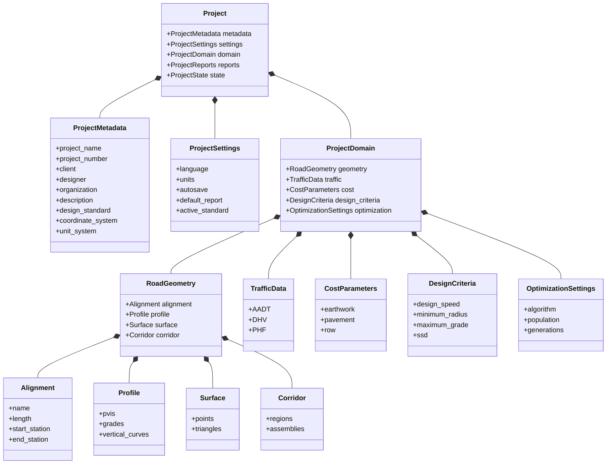
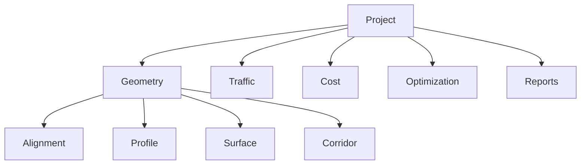

# UML Data Model

## Overview

This document presents the Unified Modeling Language (UML) representation of the engineering data model used by the Constructive Digital Twin Road Optimization Platform (CDT-ROP).

The UML diagrams describe the static structure of the engineering domain and illustrate the relationships among the core classes.

---

# UML Scope

The current UML model covers:

- Project
- Metadata
- Settings
- Road Geometry
- Traffic
- Cost
- Design Criteria
- Optimization

Future versions will extend the UML to include:

- Digital Twin
- Weather
- Drainage
- Utilities
- Bridges
- Pavement Structure
- Asset Management

---

# Core UML Class Diagram



---

# Package Diagram



---

# Data Ownership

```
Project

├── Metadata

├── Settings

├── Domain

│      ├── Geometry

│      │      ├── Alignment

│      │      ├── Profile

│      │      ├── Surface

│      │      └── Corridor

│      │

│      ├── Traffic

│      ├── Cost

│      ├── Design Criteria

│      └── Optimization

│

├── Reports

└── State
```

---

# UML Relationships

The engineering model uses the following UML relationships.

| Relationship | Usage |
|--------------|-------|
| Composition | Primary ownership between Project and engineering domains |
| Association | Interaction between calculation modules and engineering models |
| Dependency | Calculation engines depend on engineering models |
| Aggregation | May be introduced in future extensions where shared ownership is required |

---

# Design Principles

The UML model follows these principles.

- Composition over inheritance
- Domain-driven organization
- High cohesion
- Low coupling
- Strong typing
- Modular architecture
- Single Source of Truth

---

# Planned UML Extensions

Future UML diagrams will include:

- Digital Twin Model
- BIM Integration Model
- GIS Integration Model
- Optimization Workflow
- Reporting Workflow
- Civil 3D Integration
- Plugin Architecture

---

# Related Documents

- models_design.md
- project_class_diagram.md
- object_relationship.md
- project_schema.md
- system_architecture.md